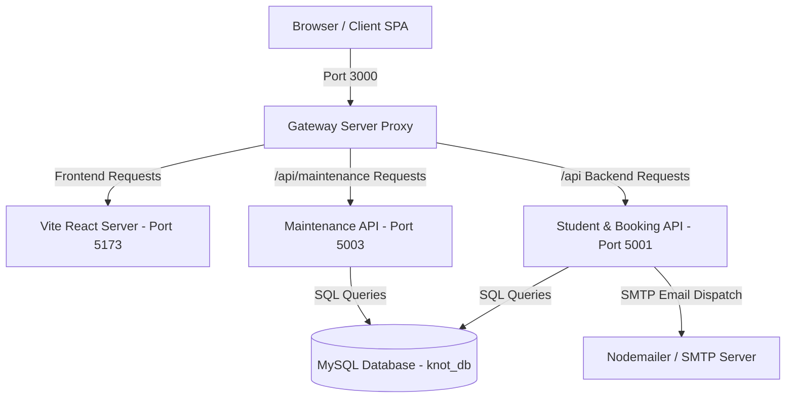
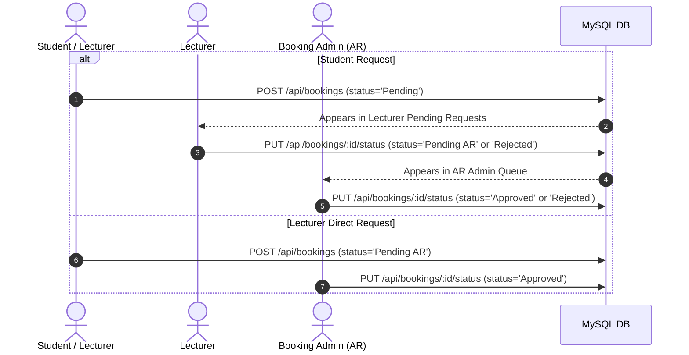

# Project KNOT – Developer & Maintainer Guide

Welcome to the **Developer & Maintainer Guide** for **Project KNOT** (University Resource & Maintenance Management Platform, Faculty of Engineering).

This guide provides technical specifications, architectural blueprints, database models, environment configurations, core workflow logic, and API references required to build, test, extend, and deploy the system.

---

## 📌 Table of Contents
1. [System Architecture & Technology Stack](#1-system-architecture--technology-stack)
2. [Repository & Directory Organization](#2-repository--directory-organization)
3. [Database Schema & ER Specifications](#3-database-schema--er-specifications)
4. [Environment Setup & Installation](#4-environment-setup--installation)
5. [Core System Logic & Workflows](#5-core-system-logic--workflows)
   - [5.1 Multi-Tier Academic Booking Workflow](#51-multi-tier-academic-booking-workflow)
   - [5.2 2-Step Booking Verification Engine](#52-2-step-booking-verification-engine)
   - [5.3 Auto-Booking Approval Engine](#53-auto-booking-approval-engine)
   - [5.4 Maintenance Ticketing & Dispatch Pipeline](#54-maintenance-ticketing--dispatch-pipeline)
   - [5.5 Master Semester Schedule Importer](#55-master-semester-schedule-importer)
6. [API Endpoint Reference](#6-api-endpoint-reference)
7. [Email & Notification Services](#7-email--notification-services)
8. [Production Deployment & Maintenance](#8-production-deployment--maintenance)

---

## 1. System Architecture & Technology Stack

KNOT is architected as a decoupled micro-service application managed by a central **Gateway Server**.



### Technology Stack Overview
- **Frontend Core**: React 18, Vite, React Router DOM v6
- **Styling & UI**: Vanilla CSS, Tailwind CSS, Glassmorphic Design Token System, Lucide Icons, Material Icons
- **Interactive Maps & Geospatial**: OpenStreetMap Leaflet (`leaflet`, `react-leaflet`), Nominatim Geocoding API
- **Backend Core**: Node.js, Express.js
- **Database**: MySQL 8.0 / MariaDB, `mysql2/promise` with Connection Pooling
- **Background Jobs**: Node.js Cron Timers (`setInterval` background workers in `server.js`)
- **Email Dispatcher**: Nodemailer with SMTP transport (Gmail App Passwords or custom SMTP)
- **HTTP Client**: Axios with interceptors and bearer token management

---

## 2. Repository & Directory Organization

```
e22-co2060-Project-KNOT/
├── README.md                           # Master repository summary
├── task.md                             # Active task tracking
├── docs/                               # System documentation & GitHub Pages site
│   ├── README.md                       # Documentation homepage
│   ├── DEVELOPER_GUIDE.md              # Software architecture & technical developer guide
│   └── USER_MANUAL.md                  # Comprehensive user manual across all roles
└── code/KNOT_Basement/
    ├── gateway_server.js               # Central reverse proxy & routing hub (Port 3000)
    ├── package.json                    # Root workspace package script manifest
    ├── Student_Portal/
    │   ├── database/
    │   │   └── setup_db.js             # Automated database & table schema migration script
    │   ├── backend/
    │   │   ├── server.js               # Primary REST API backend (Port 5001) & Cron engine
    │   │   ├── emailService.js         # Nodemailer email notification handlers
    │   │   └── package.json
    │   └── frontend/
    │       ├── src/
    │       │   ├── components/         # Navbar, Verification Banner, Profile Modal, etc.
    │       │   ├── pages/              # Role-specific dashboards (Student, Lecturer, Tech)
    │       │   │   └── admin/          # BookingAdminDashboard, MaintenanceDashboard, etc.
    │       │   ├── App.jsx             # Main router & authentication state provider
    │       │   └── index.css           # Global theme variables & Glassmorphic CSS tokens
    │       ├── package.json
    │       └── vite.config.js
    └── maintenance_system/             # Maintenance ticketing service
        ├── server/                     # Express maintenance backend (Port 5003)
        ├── client/                     # Maintenance sub-components & admin panels
        └── schema.sql                  # Maintenance tables backup SQL script
```

---

## 3. Database Schema & ER Specifications

The relational database is named `knot_db` and contains 6 primary tables.

### 3.1 `users` Table
Stores user accounts, credentials, role privileges, and contact details.

| Column Name | Data Type | Modifiers | Description |
| :--- | :--- | :--- | :--- |
| `id` | `INT` | `PRIMARY KEY AUTO_INCREMENT` | Unique user identifier |
| `username` | `VARCHAR(255)` | `UNIQUE NOT NULL` | Login username / registration ID |
| `password` | `VARCHAR(255)` | `NOT NULL` | Account password |
| `name` | `VARCHAR(255)` | `NOT NULL` | Full display name |
| `role` | `VARCHAR(50)` | `NOT NULL` | Role: `Student`, `Lecturer`, `booking_admin`, `maintenance_admin`, `Technician` |
| `department` | `VARCHAR(255)` | `NULL` | Department or organizational unit |
| `email` | `VARCHAR(255)` | `UNIQUE NULL` | User email address for notifications |
| `phone` | `VARCHAR(50)` | `NULL` | Contact phone number |
| `employee_no` | `VARCHAR(100)` | `NULL` | Employee, Lecturer, or Registration Number |
| `address` | `TEXT` | `NULL` | Residential / campus address |
| `avatar` | `LONGTEXT` | `NULL` | Base64 profile photo / avatar URL |

---

### 3.2 `bookings` Table
Tracks all lecture hall, drawing office, and lab reservation requests.

| Column Name | Data Type | Modifiers | Description |
| :--- | :--- | :--- | :--- |
| `id` | `INT` | `PRIMARY KEY AUTO_INCREMENT` | Unique booking ID |
| `title` | `VARCHAR(255)` | `NOT NULL` | Hall / Room name (e.g. `EOE Hall`) |
| `time_display` | `VARCHAR(255)` | `NOT NULL` | Human-readable schedule string |
| `start_datetime` | `DATETIME` | `NULL` | Structured reservation start time |
| `end_time` | `DATETIME` | `NULL` | Structured reservation end time |
| `status` | `VARCHAR(50)` | `DEFAULT 'Pending'` | Status: `Approved`, `Pending AR`, `Pending`, `Rejected`, `Cancelled` |
| `user_id` | `INT` | `FK -> users(id)` | ID of requesting user |
| `assigned_lecturer`| `VARCHAR(255)` | `NULL` | Lecturer name (if requested by student) |
| `purpose` | `TEXT` | `NULL` | Booking purpose / course description |
| `booking_type` | `VARCHAR(50)` | `DEFAULT 'AR Office'` | Request workflow type |
| `rejection_reason` | `TEXT` | `NULL` | Admin/Lecturer rejection feedback notes |
| `verification_status`| `VARCHAR(50)`| `DEFAULT 'unrequired'`| 2-step verification state (`unrequired`, `pending`, `verified`, `expired`) |
| `verification_prompt_time`| `DATETIME`| `NULL` | Time when 2-step verification modal is activated |
| `verification_deadline`| `DATETIME`| `NULL` | Expiry deadline to confirm booking |
| `verification_notified`| `BOOLEAN`| `DEFAULT FALSE` | Email prompt notification status flag |

---

### 3.3 `faults` (Tickets) Table
Tracks infrastructure fault reports and maintenance requests.

| Column Name | Data Type | Modifiers | Description |
| :--- | :--- | :--- | :--- |
| `id` | `INT` | `PRIMARY KEY AUTO_INCREMENT` | Ticket ID |
| `title` | `VARCHAR(255)` | `NOT NULL` | Issue title / location summary |
| `description` | `TEXT` | `NULL` | Detailed fault description |
| `location` | `TEXT` | `NULL` | Latitude, Longitude, and address text |
| `status` | `VARCHAR(50)` | `DEFAULT 'Open'` | Status: `Open`, `In Progress`, `Resolved` |
| `priority` | `VARCHAR(50)` | `DEFAULT 'Medium'` | Priority: `Low`, `Medium`, `High`, `Urgent` |
| `user_id` | `INT` | `FK -> users(id)` | Reporter user ID |
| `assigned_technician_id`| `INT` | `FK -> users(id)` | Assigned field technician user ID |
| `photo_url` | `LONGTEXT` | `NULL` | Base64 user evidence photo |
| `worker_photo` | `LONGTEXT` | `NULL` | Base64 technician proof-of-work photo |
| `maintenance_notes`| `TEXT` | `NULL` | Resolution notes entered by technician |
| `manager_notes` | `TEXT` | `NULL` | Directives attached by maintenance admin |
| `created_at` | `DATETIME` | `DEFAULT CURRENT_TIMESTAMP` | Fault creation timestamp |
| `resolved_at` | `DATETIME` | `NULL` | Resolution completion timestamp |

---

### 3.4 `rooms` Table
Master catalog of university lecture halls, drawing offices, and laboratories.

| Column Name | Data Type | Modifiers | Description |
| :--- | :--- | :--- | :--- |
| `id` | `INT` | `PRIMARY KEY AUTO_INCREMENT` | Room ID |
| `name` | `VARCHAR(255)` | `NOT NULL` | Standard room name |
| `capacity` | `INT` | `DEFAULT 30` | Seating capacity |
| `type` | `VARCHAR(50)` | `DEFAULT 'Lecture Hall'` | Type: `Lecture Hall`, `Drawing Office`, `Lab`, `Seminar Room` |
| `status` | `VARCHAR(50)` | `DEFAULT 'Available'` | Operational status |

---

### 3.5 `settings` Table
Key-value store for global system settings.

| Setting Key | Allowed Values | Description |
| :--- | :--- | :--- |
| `auto_booking` | `'true'` / `'false'` | Toggle automated conflict-free booking approvals |

---

## 4. Environment Setup & Installation

### 4.1 Prerequisites
- **Node.js**: v18.0.0 or higher
- **npm**: v9.0.0 or higher
- **MySQL Server**: v8.0 or MariaDB v10.5+

### 4.2 Backend Environment Configuration
Create a `.env` file in `code/KNOT_Basement/Student_Portal/backend/.env`:

```env
PORT=5001
DB_HOST=localhost
DB_USER=root
DB_PASSWORD=your_mysql_password
DB_NAME=knot_db
JWT_SECRET=knot_super_secret_jwt_key_2026

# Email Dispatcher Credentials (SMTP)
EMAIL_USER=your_email@gmail.com
EMAIL_PASS=your_app_password
HOST_URL=http://localhost:3000
FRONTEND_URL=http://localhost:3000
```

### 4.3 Database Setup Execution
Execute the automated database initialization script:
```bash
node code/KNOT_Basement/Student_Portal/database/setup_db.js
```

### 4.4 Launching Local Environment via Gateway Server
The application uses a gateway server that launches all services on a single port:
```bash
node code/KNOT_Basement/gateway_server.js
```
Navigate to **`http://localhost:3000`** in your browser.

---

## 5. Core System Logic & Workflows

### 5.1 Multi-Tier Academic Booking Workflow



---

### 5.2 2-Step Booking Verification Engine

To prevent reserved halls from remaining empty due to no-shows, KNOT implements an automated **2-Step Verification System**.

```
                           [ Booking Created ]
                                    |
                    +---------------+---------------+
                    |                               |
        Booked > 12 Hours in Advance     Booked < 12 Hours in Advance
                    |                               |
          Prompt: 24h before Start        Prompt: 7:00 AM on Day of Slot
         Deadline: 12h before Start      Deadline: 7:30 AM on Day of Slot
                    |                               |
                    +---------------+---------------+
                                    |
                         [ Background Cron Checks ]
                                    |
                  +-----------------+-----------------+
                  |                                   |
         User Confirms Booking              Deadline Passes without Action
                  |                                   |
           Status = Verified                 Status = Cancelled & Slot Freed
```

- **Cron Routine**: `processBooking2StepVerifications()` runs every 60 seconds inside `Student_Portal/backend/server.js`.
- **Automatic Notifications**: Sends email notifications to bookers when verification prompts open or when bookings expire due to missed deadlines.

---

### 5.3 Auto-Booking Approval Engine
- When `auto_booking` in `settings` is set to `'true'`, incoming requests that have no overlapping approved bookings for the selected room and timeframe bypass manual AR Office review and are immediately marked `Approved`.

---

### 5.4 Maintenance Ticketing & Dispatch Pipeline
1. **User Submission**: User places a pin on OpenStreetMap, attaches Base64 photo evidence, and submits a fault.
2. **Admin Review & Dispatch**: Maintenance Admin opens ticket details, inspects evidence photos and map location, selects a technician (`assigned_technician_id`), adds manager instructions, and sets priority.
3. **Technician Execution**: Assigned technician accesses `TechnicianDashboard`, opens task modal, updates status to `In Progress` or `Resolved`, attaches resolution notes, and uploads proof-of-work photo.

---

### 5.5 Master Semester Schedule Importer
- **File Parsing**: Ingests CSV timetable schedules.
- **Validation**: Verifies hall names against the standard 10 room names (`EOE Hall`, `DO1`, `DO2`, `LH01`, `LH02`, `Seminar Room A`, `Seminar Room B`, `Computer Lab 01`, `Computer Lab 02`, `Electronics Lab`).
- **Conflict Handling**: Checks for existing approved bookings; skips overlapping slots and bulk-populates recurring weekly semester slots.

---

## 6. API Endpoint Reference

### 6.1 Authentication (`/api/auth`)
- `POST /api/auth/login`: Authenticates user and returns JWT + user profile.
- `GET /api/auth/profile`: Fetches current user profile.
- `PUT /api/auth/profile`: Updates profile details (name, email, phone, employee ID, address, avatar).

### 6.2 Bookings (`/api/bookings`)
- `GET /api/bookings`: Returns all bookings (filtered by user role/query).
- `POST /api/bookings`: Submits a new hall reservation request.
- `PUT /api/bookings/:id/status`: Updates booking status (`Approved`, `Pending AR`, `Rejected`).
- `GET /api/bookings/verifications/:userId`: Fetches active 2-step verification prompts for a user.
- `PUT /api/bookings/:id/verify`: Confirms or cancels a 2-step verification prompt.
- `POST /api/bookings/bulk-import`: Parses and imports semester CSV timetable.

### 6.3 Maintenance Tickets (`/api/tickets`)
- `GET /api/tickets`: Returns maintenance tickets.
- `POST /api/tickets`: Creates a new maintenance ticket with photo attachment and location coordinates.
- `PUT /api/tickets/:id`: Updates ticket details, assigned technician, status, or worker resolution notes.
- `GET /api/tickets/technician/:techId`: Fetches tickets assigned specifically to a given technician ID.

### 6.4 Settings & Rooms (`/api/settings`, `/api/halls`)
- `GET /api/halls`: Returns list of all rooms and operational statuses.
- `GET /api/settings`: Returns global system setting key-values.
- `PUT /api/settings`: Updates global system settings (e.g. `auto_booking`).

---

## 7. Email & Notification Services

Email notifications are dispatched asynchronously via `emailService.js`.

| Trigger Event | Recipient | Email Template Function |
| :--- | :--- | :--- |
| **New Fault Ticket Created** | User & Admin | `sendTicketCreatedNotification()` |
| **Technician Assigned** | Assigned Worker | `sendTechnicianAssignmentNotification()` |
| **Ticket Status Resolved** | Reporter | `sendTicketResolvedNotification()` |
| **Booking Verification Required** | Bookers | `sendBookingVerificationPromptNotification()` |
| **Booking Verification Confirmed** | Bookers | `sendBookingVerificationConfirmedNotification()` |
| **Booking Cancelled (Deadline Expiry)**| Bookers | `sendBookingVerificationExpiredNotification()` |

---

## 8. Production Deployment & Maintenance

1. **Database Deployment**: Import MySQL schema into production MySQL/Cloud SQL instance.
2. **Environment Variables**: Configure production `.env` with strong `JWT_SECRET` and SMTP credentials.
3. **Process Management**: Run gateway server using PM2:
   ```bash
   npm install -g pm2
   pm2 start code/KNOT_Basement/gateway_server.js --name "knot-gateway"
   pm2 save
   ```
4. **Reverse Proxy & SSL**: Configure Nginx or Apache to proxy SSL (HTTPS port 443) to local Gateway port 3000.
