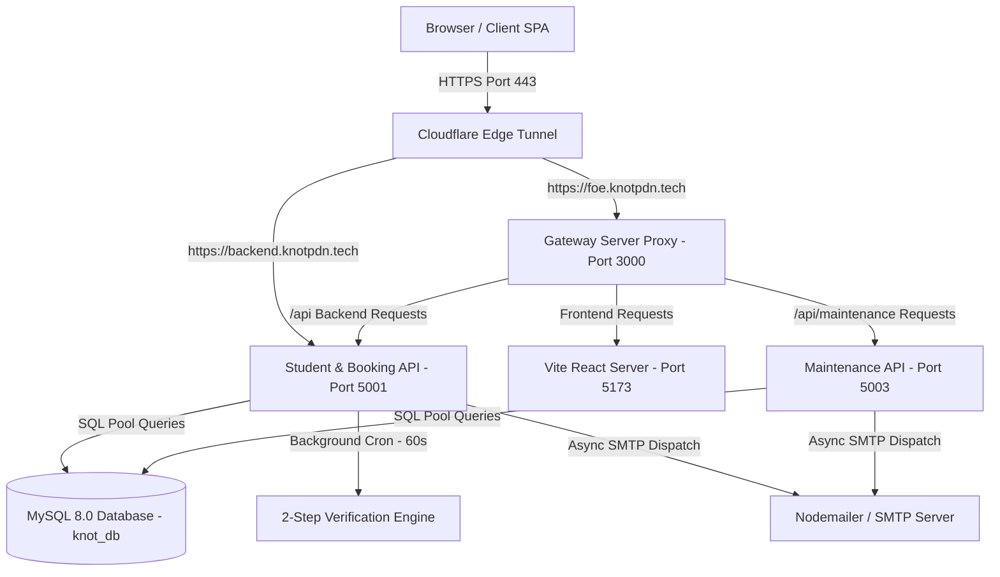
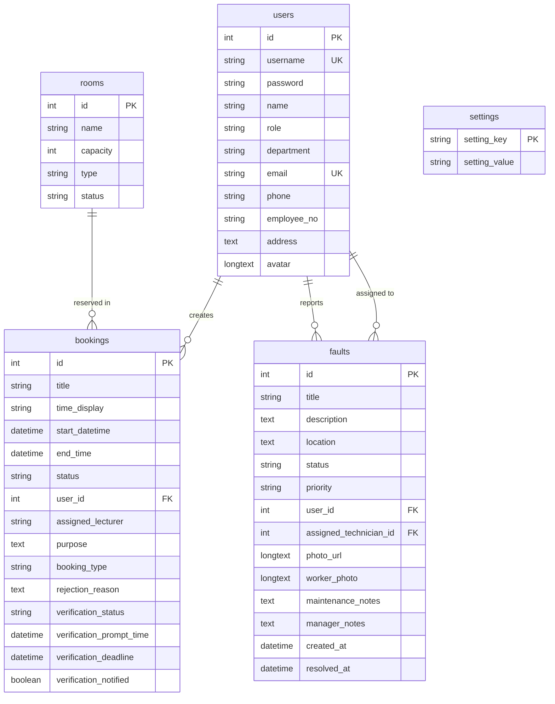
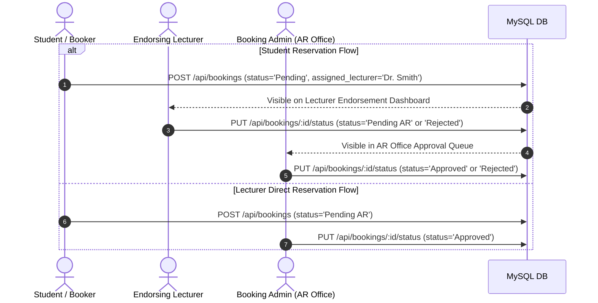
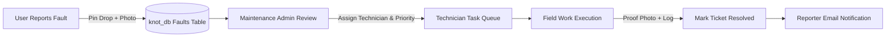
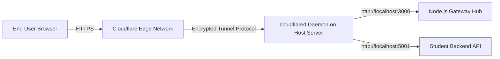

# Project KNOT – Comprehensive Developer & Maintainer Guide
> **University Resource & Maintenance Management Platform**  
> **Faculty of Engineering, University of Peradeniya**  
> **Document Version**: 2.5.0 | **Last Updated**: September 2026

---

## 📌 Table of Contents
1. [System Architecture & Technology Stack](#1-system-architecture--technology-stack)
2. [Repository & Workspace Organization](#2-repository--workspace-organization)
3. [Database Schema & ER Specifications](#3-database-schema--er-specifications)
4. [Environment Setup & Local Installation](#4-environment-setup--local-installation)
5. [Core System Logic & Workflows](#5-core-system-logic--workflows)
   - [5.1 Multi-Tier Academic Booking Workflow](#51-multi-tier-academic-booking-workflow)
   - [5.2 Automated 2-Step Booking Verification Engine](#52-automated-2-step-booking-verification-engine)
   - [5.3 Conflict-Free Auto-Booking Approval Engine](#53-conflict-free-auto-booking-approval-engine)
   - [5.4 Maintenance Ticketing & GIS Dispatch Pipeline](#54-maintenance-ticketing--gis-dispatch-pipeline)
   - [5.5 Master Semester Schedule Importer](#55-master-semester-schedule-importer)
6. [API Endpoint Reference](#6-api-endpoint-reference)
   - [6.1 Authentication Endpoints (`/api/auth`)](#61-authentication-endpoints-apiauth)
   - [6.2 Booking Endpoints (`/api/bookings`)](#62-booking-endpoints-apibookings)
   - [6.3 Maintenance & Ticketing Endpoints (`/api/tickets`)](#63-maintenance--ticketing-endpoints-apitickets)
   - [6.4 System Settings & Rooms Endpoints (`/api/settings`, `/api/halls`)](#64-system-settings--rooms-endpoints-apisettings-apihalls)
7. [Email & Notification Services](#7-email--notification-services)
8. [Cloudflare Tunnel & Hosted Server Deployment](#8-cloudflare-tunnel--hosted-server-deployment)
   - [8.1 Cloudflare Tunnel Architecture](#81-cloudflare-tunnel-architecture)
   - [8.2 `cloudflared` Daemon Installation & Ingress Setup](#82-cloudflared-daemon-installation--ingress-setup)
   - [8.3 PM2 Production Process Management](#83-pm2-production-process-management)
   - [8.4 SSL/TLS & Edge Security Configuration](#84-ssltls--edge-security-configuration)
9. [Docker Containerization & Multi-Container Stack](#9-docker-containerization--multi-container-stack)
10. [Testing, Monitoring & Maintenance Procedures](#10-testing-monitoring--maintenance-procedures)

---

## 1. System Architecture & Technology Stack

**Project KNOT** is architected as a decoupled micro-service platform managed by a central **Gateway Server**. It integrates academic resource reservations with campus maintenance ticketing.



### Technology Stack Matrix

| Layer | Component / Technology | Specification & Role |
| :--- | :--- | :--- |
| **Frontend Core** | React 18, Vite | High-performance SPA with fast HMR |
| **Routing** | React Router DOM v6 | Role-guarded client-side routes |
| **Styling & UI Tokens**| Vanilla CSS, Tailwind CSS | Custom Glassmorphic design tokens & responsive components |
| **Map & GIS** | Leaflet, React-Leaflet, Nominatim API | Interactive pin-dropping & reverse geocoding |
| **Backend Core** | Node.js (v18+), Express.js | REST APIs supporting 50MB Base64 payload limits |
| **Database** | MySQL 8.0 / MariaDB 10.5+ | `mysql2/promise` with connection pooling |
| **Background Jobs** | Node.js Interval Timers | Minute-by-minute 2-Step Verification Cron Worker |
| **Email Service** | Nodemailer | Async HTML notification dispatch via SMTP |
| **Reverse Proxy** | Custom Node.js Gateway & Nginx | Unified single-port entry point & production ingress |
| **Hosting & Tunnel** | Cloudflare Tunnels (`cloudflared`) | Secure zero-trust HTTPS edge proxy to hosted server |

---

## 2. Repository & Workspace Organization

```
e22-co2060-Project-KNOT/
├── README.md                           # Master repository project summary & overview
├── task.md                             # Active task tracking log
├── docker-compose.yml                  # Multi-container orchestration definition
├── .env                                # Production environment configuration
├── docs/                               # System documentation directory
│   ├── DEVELOPER_GUIDE.md              # Complete software architecture & technical guide
│   ├── USER_MANUAL.md                  # Comprehensive end-user role manual
│   ├── TESTING_AND_VALIDATION.md       # Test execution report & validation matrix
│   └── DOCKER_GUIDE.md                 # Containerization & Docker Compose deployment guide
└── code/KNOT_Basement/
    ├── gateway_server.js               # Gateway reverse proxy & child process manager (Port 3000)
    ├── package.json                    # Workspace root npm dependencies & scripts
    ├── Dockerfile                      # Gateway container image definition
    ├── Student_Portal/
    │   ├── database/
    │   │   └── setup_db.js             # Automated database creation & schema migration script
    │   ├── backend/
    │   │   ├── server.js               # Primary REST API backend (Port 5001) & 2-Step Cron Engine
    │   │   ├── emailService.js         # Nodemailer email notification templates & dispatch logic
    │   │   ├── test_runner.js          # Automated backend integration test suite
    │   │   └── package.json
    │   └── frontend/
    │       ├── src/
    │       │   ├── components/         # Shared UI components (Navbar, Banners, Modals)
    │       │   ├── pages/              # Dashboards (Student, Lecturer, Technician)
    │       │   │   └── admin/          # Admin Dashboards (BookingAdmin, MaintenanceAdmin)
    │       │   ├── config/
    │       │   │   └── api.js          # Dynamic Axios base URL & interceptors config
    │       │   ├── App.jsx             # Main router & auth provider
    │       │   └── index.css           # Glassmorphic CSS token system & styles
    │       ├── package.json
    │       └── vite.config.js
    └── maintenance_system/             # Maintenance ticketing service
        ├── server/
        │   ├── server.js               # Maintenance REST API server (Port 5003)
        │   ├── emailService.js         # Maintenance ticket email notifications
        │   └── package.json
        └── client/                     # Maintenance UI sub-modules
```

---

## 3. Database Schema & ER Specifications

The database engine is MySQL 8.0 containing the `knot_db` database.



### 3.1 Table Specifications

#### `users` Table
Stores authentication accounts, role permissions, and contact profiles.
- **Roles**: `Student`, `Lecturer`, `booking_admin`, `maintenance_admin`, `Technician`.

| Column Name | Data Type | Modifiers | Description |
| :--- | :--- | :--- | :--- |
| `id` | `INT` | `PRIMARY KEY AUTO_INCREMENT` | Unique user account ID |
| `username` | `VARCHAR(255)` | `UNIQUE NOT NULL` | Login username / Registration ID |
| `password` | `VARCHAR(255)` | `NOT NULL` | Account password |
| `name` | `VARCHAR(255)` | `NOT NULL` | Full display name |
| `role` | `VARCHAR(50)` | `NOT NULL` | Access control role tag |
| `department` | `VARCHAR(255)` | `NULL` | Faculty department |
| `email` | `VARCHAR(255)` | `UNIQUE NULL` | User email address for notifications |
| `phone` | `VARCHAR(50)` | `NULL` | Contact telephone number |
| `employee_no` | `VARCHAR(100)` | `NULL` | Employee / Registration number |
| `address` | `TEXT` | `NULL` | Residential / campus address |
| `avatar` | `LONGTEXT` | `NULL` | Base64 profile photo data |

#### `bookings` Table
Stores hall reservations, schedule times, approval statuses, and 2-step verification states.

| Column Name | Data Type | Modifiers | Description |
| :--- | :--- | :--- | :--- |
| `id` | `INT` | `PRIMARY KEY AUTO_INCREMENT` | Unique booking ID |
| `title` | `VARCHAR(255)` | `NOT NULL` | Reserved room name (e.g. `EOE Hall`) |
| `time_display` | `VARCHAR(255)` | `NOT NULL` | Human-readable schedule string |
| `start_datetime` | `DATETIME` | `NULL` | Structured reservation start timestamp |
| `end_time` | `DATETIME` | `NULL` | Structured reservation end timestamp |
| `status` | `VARCHAR(50)` | `DEFAULT 'Pending'` | Workflow status (`Approved`, `Pending AR`, `Pending`, `Rejected`, `Cancelled`) |
| `user_id` | `INT` | `FK -> users(id)` | ID of booker |
| `assigned_lecturer`| `VARCHAR(255)` | `NULL` | Endorsing lecturer name |
| `purpose` | `TEXT` | `NULL` | Booking purpose / course details |
| `booking_type` | `VARCHAR(50)` | `DEFAULT 'AR Office'` | Request workflow path |
| `rejection_reason` | `TEXT` | `NULL` | Rejection feedback from admin/lecturer |
| `verification_status`| `VARCHAR(50)`| `DEFAULT 'unrequired'`| 2-Step state (`unrequired`, `pending`, `verified`, `expired`) |
| `verification_prompt_time`| `DATETIME`| `NULL` | Time when 2-step prompt activates |
| `verification_deadline`| `DATETIME`| `NULL` | Verification confirmation deadline |
| `verification_notified`| `BOOLEAN`| `DEFAULT FALSE` | Flag tracking email prompt dispatch |

#### `faults` Table
Tracks reported maintenance issues, GIS coordinates, photos, and technician assignments.

| Column Name | Data Type | Modifiers | Description |
| :--- | :--- | :--- | :--- |
| `id` | `INT` | `PRIMARY KEY AUTO_INCREMENT` | Maintenance ticket ID |
| `title` | `VARCHAR(255)` | `NOT NULL` | Fault title / location tag |
| `description` | `TEXT` | `NULL` | Detailed fault report |
| `location` | `TEXT` | `NULL` | Geographic coordinates + address text |
| `status` | `VARCHAR(50)` | `DEFAULT 'Open'` | Ticket state (`Open`, `In Progress`, `Resolved`) |
| `priority` | `VARCHAR(50)` | `DEFAULT 'Medium'` | Urgency (`Low`, `Medium`, `High`, `Urgent`) |
| `user_id` | `INT` | `FK -> users(id)` | Ticket reporter ID |
| `assigned_technician_id`| `INT` | `FK -> users(id)` | Assigned technician worker ID |
| `photo_url` | `LONGTEXT` | `NULL` | Base64 evidence photo from reporter |
| `worker_photo` | `LONGTEXT` | `NULL` | Base64 proof-of-work photo from technician |
| `maintenance_notes`| `TEXT` | `NULL` | Work resolution log from technician |
| `manager_notes` | `TEXT` | `NULL` | Directives from maintenance admin |
| `created_at` | `DATETIME` | `DEFAULT CURRENT_TIMESTAMP` | Ticket creation timestamp |
| `resolved_at` | `DATETIME` | `NULL` | Resolution completion timestamp |

#### `rooms` Table
Master catalog of standardized faculty lecture halls, drawing offices, and labs.

| Column Name | Data Type | Modifiers | Description |
| :--- | :--- | :--- | :--- |
| `id` | `INT` | `PRIMARY KEY AUTO_INCREMENT` | Room ID |
| `name` | `VARCHAR(255)` | `NOT NULL` | Standard room name |
| `capacity` | `INT` | `DEFAULT 30` | Seating capacity |
| `type` | `VARCHAR(50)` | `DEFAULT 'Lecture Hall'` | Room classification |
| `status` | `VARCHAR(50)` | `DEFAULT 'Available'` | Room operational status |

#### `settings` Table
Key-value store for global platform flags.

| Setting Key | Allowed Values | Description |
| :--- | :--- | :--- |
| `auto_booking` | `'true'` / `'false'` | Toggle instant automated booking approvals for conflict-free requests |

---

## 4. Environment Setup & Local Installation

### 4.1 Prerequisites
- **Node.js**: v18.0.0 or higher
- **npm**: v9.0.0 or higher
- **MySQL**: v8.0 or MariaDB v10.5+

### 4.2 Master Environment Variables (`.env`)
Create or verify `.env` in the root workspace directory or `code/KNOT_Basement/.env`:

```env
# Database Credentials
DB_HOST=localhost
DB_USER=root
DB_PASSWORD=your_mysql_password
DB_NAME=knot_db
DB_PORT=3306
MYSQL_ROOT_PASSWORD=your_mysql_password
MYSQL_DATABASE=knot_db

# Security & Tokens
JWT_SECRET=knot_super_secret_jwt_key_2026

# Email Dispatcher Credentials (SMTP)
EMAIL_USER=minhaj.dssc2@gmail.com
EMAIL_PASS=wvvnkowdrbnfetva
SMTP_HOST=smtp.gmail.com
SMTP_PORT=587
SMTP_SECURE=false
SMTP_USER=minhaj.dssc2@gmail.com
SMTP_PASS=wvvnkowdrbnfetva

# Application Service Ports
PORT=5001
MAINTENANCE_PORT=5003
GATEWAY_PORT=3000
FRONTEND_PORT=5173

# Base Domain URLs
FRONTEND_URL=https://foe.knotpdn.tech
BACKEND_URL=https://backend.knotpdn.tech
VITE_API_URL=https://backend.knotpdn.tech
```

### 4.3 Database Schema Initialization
Run the database setup script to create tables and seed demo accounts:
```bash
node code/KNOT_Basement/Student_Portal/database/setup_db.js
```

### 4.4 Launching System via Gateway Server
The **Gateway Server** starts all child micro-services and serves as a unified proxy hub:
```bash
node code/KNOT_Basement/gateway_server.js
```
Access the application locally at **`http://localhost:3000`**.

### 4.5 Demo Access Accounts Matrix

| Role | Username | Password | Email Address |
| :--- | :--- | :--- | :--- |
| **Student** | `e22237` | `1234` | `e22237@eng.pdn.ac.lk` |
| **Lecturer** | `lecturer1` | `1234` | `lecturer1@eng.pdn.ac.lk` |
| **Booking Admin (AR)** | `bookadmin` | `adminpass` | `ar.office@eng.pdn.ac.lk` |
| **Maintenance Admin** | `admin` | `adminpass` | `maint.admin@eng.pdn.ac.lk` |
| **Technician** | `alex` | `1234` | `alex.tech@eng.pdn.ac.lk` |

---

## 5. Core System Logic & Workflows

### 5.1 Multi-Tier Academic Booking Workflow



---

### 5.2 Automated 2-Step Booking Verification Engine

To eliminate empty halls caused by no-shows, KNOT enforces an automated 2-step verification protocol.

```
                           [ Booking Approved ]
                                    |
                    +---------------+---------------+
                    |                               |
        Booked > 12 Hours in Advance     Booked < 12 Hours in Advance
                    |                               |
          Prompt: 24h before Start        Prompt: 7:00 AM on Day of Slot
          Deadline: 12h before Start      Deadline: 7:30 AM on Day of Slot
                    |                               |
                    +---------------+---------------+
                                    |
                         [ Background Cron Checks ]
                                    |
                  +-----------------+-----------------+
                  |                                   |
         User Confirms Booking              Deadline Passes without Action
                  |                                   |
           Status = Verified                 Status = Cancelled & Slot Freed
```

1. **Cron Routine**: `processBooking2StepVerifications()` executes every **60 seconds** in `Student_Portal/backend/server.js`.
2. **Notification Dispatch**: Sends email prompts when verification opens and notifies bookers if bookings expire due to missed deadlines.

---

### 5.3 Conflict-Free Auto-Booking Approval Engine
- Controlled by `auto_booking` in `settings`.
- When set to `'true'`, incoming reservation requests undergo automatic overlap checks against all existing `Approved` bookings for the same room. If no schedule overlap occurs, the request is immediately marked `Approved`.

---

### 5.4 Maintenance Ticketing & GIS Dispatch Pipeline



---

### 5.5 Master Semester Schedule Importer
- **Purpose**: Meets the Dean's requirement for bulk timetable ingestion.
- **CSV Ingestion**: Accepts timetable CSV files containing `Room`, `Day`, `Start Time`, `End Time`, and `Course/Lecturer`.
- **Validation**: Normalizes hall names against the 10 standard rooms (`EOE Hall`, `DO1`, `DO2`, `LH01`, `LH02`, `Seminar Room A`, `Seminar Room B`, `Computer Lab 01`, `Computer Lab 02`, `Electronics Lab`).
- **Conflict Handling**: Checks existing database schedules, skips conflicting slots, and populates recurring weekly reservations.

---

## 6. API Endpoint Reference

### 6.1 Authentication Endpoints (`/api/auth`)

#### `POST /api/auth/login`
Authenticates user credentials and returns JWT bearer token + user profile.
- **Request Body**:
  ```json
  {
    "username": "e22237",
    "password": "1234"
  }
  ```
- **Response `200 OK`**:
  ```json
  {
    "token": "eyJhbGciOiJIUzI1NiIsInR5cCI6IkpXVCJ9...",
    "user": {
      "id": 1,
      "username": "e22237",
      "name": "Minhaj Ali",
      "role": "Student",
      "email": "e22237@eng.pdn.ac.lk"
    }
  }
  ```

#### `GET /api/auth/profile`
Fetches authenticated user profile details.
- **Headers**: `Authorization: Bearer <token>`

#### `PUT /api/auth/profile`
Updates profile information (name, email, phone, employee number, address, avatar).

---

### 6.2 Booking Endpoints (`/api/bookings`)

#### `GET /api/bookings`
Retrieves room reservations based on role permissions and filters.

#### `POST /api/bookings`
Submits a new room reservation request.
- **Request Body**:
  ```json
  {
    "title": "EOE Hall - Engineering South",
    "time_display": "Tomorrow, 10:00 AM - 12:00 PM",
    "start_datetime": "2026-09-26 10:00:00",
    "end_time": "2026-09-26 12:00:00",
    "purpose": "CO2060 Lecture",
    "assigned_lecturer": "Dr. Smith"
  }
  ```

#### `PUT /api/bookings/:id/status`
Updates booking approval status (`Approved`, `Pending AR`, `Rejected`, `Cancelled`).

#### `GET /api/bookings/verifications/:userId`
Retrieves pending 2-step verification prompts for a user.

#### `PUT /api/bookings/:id/verify`
Confirms or cancels a 2-step verification prompt.

#### `POST /api/bookings/bulk-import`
Parses and imports master semester timetable CSV files.

---

### 6.3 Maintenance & Ticketing Endpoints (`/api/tickets`)

#### `GET /api/tickets`
Returns all maintenance tickets (with optional priority/status filters).

#### `POST /api/tickets`
Creates a new maintenance ticket with GIS pin coordinates and Base64 evidence photo.
- **Request Body**:
  ```json
  {
    "title": "Projector Fault - Room 1",
    "description": "HDMI port damaged",
    "location": "{\"lat\":7.2543,\"lng\":80.5921,\"address\":\"Faculty of Engineering\"}",
    "priority": "High",
    "photo_url": "data:image/png;base64,..."
  }
  ```

#### `PUT /api/tickets/:id`
Updates ticket details, assigned technician ID, worker notes, or proof-of-work photo.

#### `GET /api/tickets/technician/:techId`
Fetches tasks assigned to a specific field technician.

---

### 6.4 System Settings & Rooms Endpoints (`/api/settings`, `/api/halls`)

#### `GET /api/halls`
Returns master room list and operational statuses.

#### `GET /api/settings`
Returns global system settings.

#### `PUT /api/settings`
Updates global setting key-value pairs (e.g. `auto_booking`).

---

## 7. Email & Notification Services

Email notifications are dispatched asynchronously via `emailService.js` using Nodemailer.

| Trigger Event | Recipient | Email Template Function |
| :--- | :--- | :--- |
| **Fault Ticket Created** | Reporter & Maintenance Admin | `sendTicketCreatedNotification()` |
| **Technician Assigned** | Assigned Worker | `sendTechnicianAssignmentNotification()` |
| **Ticket Resolved** | Ticket Reporter | `sendTicketResolvedNotification()` |
| **2-Step Verification Prompt** | Booker | `sendBookingVerificationPromptNotification()` |
| **Booking Confirmed** | Booker | `sendBookingVerificationConfirmedNotification()` |
| **Booking Cancelled (Expiry)** | Booker | `sendBookingVerificationExpiredNotification()` |

---

## 8. Cloudflare Tunnel & Hosted Server Deployment

To expose the locally hosted server securely over HTTPS without configuring complex firewall port forwarding or static public IPs, **Project KNOT** utilizes **Cloudflare Tunnels (`cloudflared`)**.



### 8.1 Public Domain Mapping

- **Frontend Application**: `https://foe.knotpdn.tech` ➡️ Proxied to `http://localhost:3000` (Gateway Hub) or `http://localhost:5173`
- **Backend API**: `https://backend.knotpdn.tech` ➡️ Proxied to `http://localhost:5001` (Student & Booking REST API)

---

### 8.2 `cloudflared` Daemon Installation & Ingress Setup

#### Step 1: Install `cloudflared` on Host Server
- **macOS (Homebrew)**:
  ```bash
  brew install cloudflared
  ```
- **Linux (Ubuntu/Debian)**:
  ```bash
  curl -L --output cloudflared.deb https://github.com/cloudflare/cloudflared/releases/latest/download/cloudflared-linux-amd64.deb
  sudo dpkg -i cloudflared.deb
  ```

#### Step 2: Authenticate & Create Tunnel
```bash
cloudflared tunnel login
cloudflared tunnel create knot-tunnel
```
This generates a tunnel ID and credentials JSON file in `~/.cloudflared/`.

#### Step 3: Configure `config.yml`
Create a configuration file at `~/.cloudflared/config.yml`:

```yaml
tunnel: <YOUR-TUNNEL-UUID>
credentials-file: /root/.cloudflared/<YOUR-TUNNEL-UUID>.json

ingress:
  - hostname: foe.knotpdn.tech
    service: http://localhost:3000
  - hostname: backend.knotpdn.tech
    service: http://localhost:5001
  - service: http_status:404
```

#### Step 4: Map DNS Routes & Start Tunnel Daemon
```bash
cloudflared tunnel route dns knot-tunnel foe.knotpdn.tech
cloudflared tunnel route dns knot-tunnel backend.knotpdn.tech

# Run as background service
sudo cloudflared service install
sudo systemctl start cloudflared
```

---

### 8.3 PM2 Production Process Management

On the host server, use **PM2** to keep backend micro-services and the Gateway server running continuously.

```bash
# Install PM2 globally
npm install -g pm2

# Start Gateway Server
pm2 start code/KNOT_Basement/gateway_server.js --name "knot-gateway"

# Save process list for auto-restart on system boot
pm2 save
pm2 startup
```

Useful PM2 Commands:
```bash
pm2 status          # Check running status of services
pm2 logs knot-gateway # View real-time output logs
pm2 restart all     # Restart all processes
```

---

### 8.4 SSL/TLS & Edge Security Configuration
- SSL termination is managed automatically by Cloudflare's Edge Certificates.
- Set Cloudflare SSL/TLS Encryption mode to **Full** or **Flexible** in the Cloudflare Dashboard.

---

## 9. Docker Containerization & Multi-Container Stack

The entire platform can be deployed in containerized environments using Docker and Docker Compose.

```bash
# Build and launch multi-container stack in detached mode
docker-compose up --build -d
```

### Container Stack Specification

| Container Name | Base Image | Exposed Port | Purpose |
| :--- | :--- | :--- | :--- |
| `knot-db` | `mysql:8.0` | `3306` | Persistent MySQL database container |
| `knot-student-backend` | `node:18-alpine` | `5001` | Express REST API & 2-step verification cron engine |
| `knot-maintenance-backend` | `node:18-alpine` | `5003` | Maintenance ticketing backend |
| `knot-frontend` | `nginx:alpine` | `80`, `5173` | Production React SPA served via Nginx |
| `knot-gateway` | `node:18-alpine` | `3000` | Gateway reverse proxy hub |

---

## 10. Testing, Monitoring & Maintenance Procedures

### 10.1 Running Backend Automated Integration Tests
Execute the backend integration test runner:
```bash
node code/KNOT_Basement/Student_Portal/backend/test_runner.js
```

### 10.2 Database Backup & Disaster Recovery
- **Backup Database**:
  ```bash
  mysqldump -u root -p knot_db > knot_db_backup.sql
  ```
- **Restore Database**:
  ```bash
  mysql -u root -p knot_db < knot_db_backup.sql
  ```

### 10.3 Inspecting Real-Time Logs
- **Gateway Server**: Inspect terminal standard output or PM2 logs (`pm2 logs`).
- **Docker Stack**: `docker-compose logs -f backend`.

---
*For additional support or infrastructure inquiries, contact the KNOT Lead Maintainer.*
