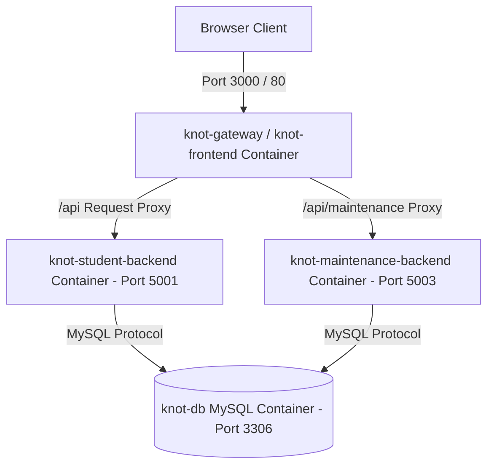

# Project KNOT – Docker Containerization & Deployment Guide

This guide provides instructions for building, running, orchestrating, and deploying **Project KNOT** using **Docker** and **Docker Compose**.

---

## 📌 Table of Contents
1. [Architecture Overview](#1-architecture-overview)
2. [Prerequisites](#2-prerequisites)
3. [Containerized Services Structure](#3-containerized-services-structure)
4. [Quick Start: One-Command Deployment](#4-quick-start-one-command-deployment)
5. [Managing & Monitoring Containers](#5-managing--monitoring-containers)
6. [Database Persistence & Migration](#6-database-persistence--migration)
7. [Environment Variables Reference](#7-environment-variables-reference)
8. [Troubleshooting & FAQ](#8-troubleshooting--faq)

---

## 1. Architecture Overview

The system is containerized into a multi-tier micro-service ecosystem orchestrated via **Docker Compose**:



---

## 2. Prerequisites

Before running the containers, ensure you have installed:
- **Docker Desktop** (v20.10.0 or higher) on macOS, Linux, or Windows.
- **Docker Compose** (v2.0.0 or higher).

Verify your installation:
```bash
docker --version
docker-compose --version
```

---

## 3. Containerized Services Structure

The system consists of 5 dedicated containers defined in `docker-compose.yml`:

| Service Name | Container Name | Image / Base | Exposed Port | Purpose |
| :--- | :--- | :--- | :--- | :--- |
| `db` | `knot-db` | `mysql:8.0` | `3306` | MySQL database engine with persistent data volume `mysql_data` |
| `backend` | `knot-student-backend` | `node:18-alpine` | `5001` | Express REST API & 2-Step Verification background cron engine |
| `maintenance-backend` | `knot-maintenance-backend` | `node:18-alpine` | `5003` | Maintenance ticketing & technician dispatch API |
| `frontend` | `knot-frontend` | `nginx:alpine` (Multi-stage) | `80`, `5173` | Production React SPA served via Nginx with API proxy rules |
| `gateway` | `knot-gateway` | `node:18-alpine` | `3000` | Unified Gateway reverse proxy hub |

---

## 4. Quick Start: One-Command Deployment

### Step 1: Clone Repository
```bash
git clone https://github.com/cepdnaclk/e22-co2060-Project-KNOT.git
cd e22-co2060-Project-KNOT
```

### Step 2: Build & Launch Container Stack
Run Docker Compose from the root project directory:
```bash
docker-compose up --build -d
```

### Step 3: Access the Application
Open your web browser and navigate to:
- **Gateway Hub**: **`http://localhost:3000`**
- **Nginx Web Portal**: **`http://localhost:80`** or **`http://localhost:5173`**
- **Student Backend API**: `http://localhost:5001/api/rooms`
- **MySQL Database**: `localhost:3306` (User: `root`, Password: `new_password`)

---

## 5. Managing & Monitoring Containers

### View Status of Containers
```bash
docker-compose ps
```

### Inspect Container Logs
To follow live logs from all services:
```bash
docker-compose logs -f
```

To follow logs from a specific service:
```bash
# Student Backend logs (2-step verification cron execution)
docker-compose logs -f backend

# MySQL database logs
docker-compose logs -f db

# Frontend Nginx logs
docker-compose logs -f frontend
```

### Stop Running Services
```bash
docker-compose stop
```

### Tear Down Stack (Keep Saved Data)
```bash
docker-compose down
```

### Tear Down Stack & Wipe Database Volume
```bash
docker-compose down -v
```

---

## 6. Database Persistence & Migration

- **Automated Schema Ingestion**: Upon container startup, the `backend` container executes `node database/setup_db.js`, creating the database schema (`knot_db`), tables (`users`, `bookings`, `faults`, `rooms`, `settings`), and populating initial seed credentials (`e22237`, `lecturer1`, `bookadmin`, `admin`, `alex`).
- **Data Persistence**: MySQL data files are persistently mapped to a Docker volume named `mysql_data`. Restarting containers preserves all data.

---

## 7. Environment Variables Reference

Key environment variables configured in `docker-compose.yml`:

```yaml
DB_HOST=db
DB_USER=root
DB_PASSWORD=new_password
DB_NAME=knot_db
PORT=5001
JWT_SECRET=knot_super_secret_jwt_key_2026
EMAIL_USER=your_email@gmail.com
EMAIL_PASS=your_app_password
```

---

## 8. Troubleshooting & FAQ

#### Q1: Database connection fails on container startup (`ECONNREFUSED`)
> **Cause**: MySQL takes a few seconds to initialize tables on first boot.
> **Solution**: The `backend` container includes a health check dependency (`depends_on: db: service_healthy`) and will wait automatically until MySQL is ready.

#### Q2: How do I access MySQL inside the container?
> Execute an interactive shell session in the database container:
> ```bash
> docker exec -it knot-db mysql -u root -pnew_password knot_db
> ```

#### Q3: Rebuilding containers after modifying source code
> If you edit frontend or backend source files, force a rebuild:
> ```bash
> docker-compose up --build -d
> ```
